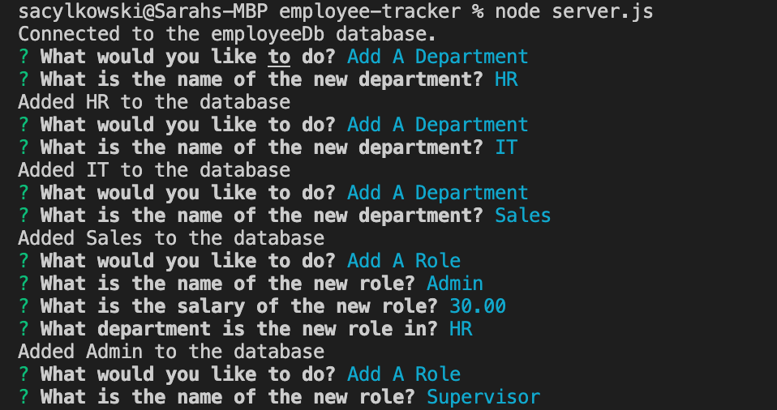

# employee-tracker

 ## Description
  This application creates an employee database, complete will departments, roles, and employees.  You get prompts from Inquirer to see tables from the database, add to the database, or update it.  

  ## Installation
  To install required dependecies, use: npm install 

  ## Usage
  To run the app, you need to log into mysql, and source db/database.sql.  Then quit to return back to your command line.  Run node server.js to start the application.

  
  
  <a href="https://drive.google.com/file/d/15FGJm1cbebhtEXRqaTf_wuaV7OmfjJ5I/view">Here is a video demo.</a>

 ## Built With
 This application is built with:  
 * Node.js
 * Inquirer
 * MySql2
 * dotenv
 * console.table

  ## Questions
  If you have any questions, please reach out on <a href="https://github.com/sacylkowski/">GitHub</a> or you can <a href="mailto:sacylkowski@gmail.com">E-mail me</a>.

